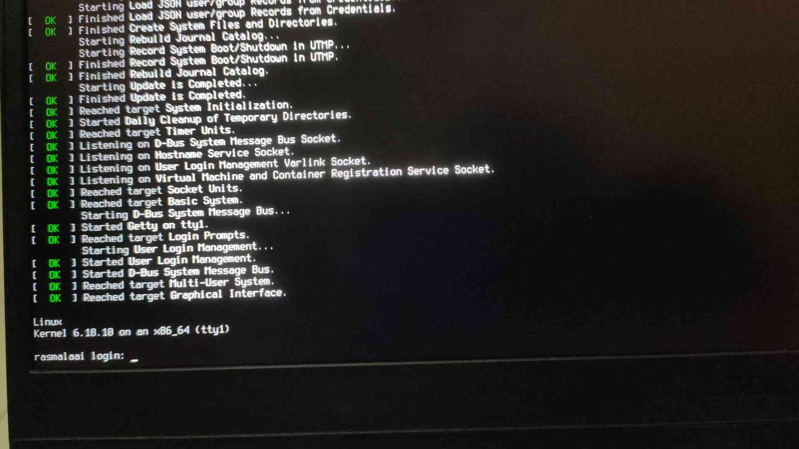

# lfs-secure

this is a custom operating system i'm building completely from source, based on the linux from scratch (lfs) methodology. 

the main goal here is proactive security. standard distros are great (i daily drive arch myself), but they usually trade security for out-of-the-box convenience. i wanted to see what it takes to secure an os from the absolute ground up, rather than just trying to patch holes and slap on firewalls later. 

### current status: base system alive

*(successful boot into the base unhardened system)*

now that the foundation is stable, active development has shifted entirely to implementing the security layers.

### what's in this repo
to be clear, you won't find a massive iso file or huge compiled binaries in here. this repo is basically the "recipe" to build the system. it tracks:
- my custom kernel `.config` files (stripped legacy features, strict memory protections)
- mandatory access control setups (apparmor profiles)
- custom bash scripts to automate the tedious compiling phases
- patches and build notes as i go

### core focus
- **kernel-level hardening:** tweaking compiler flags to severely limit the attack surface right at the core.
- **least privilege:** everything is confined. if a service somehow gets compromised, the blast radius is minimal.
- **strict memory protections:** implementing defenses against standard buffer overflows and memory corruption tactics.
